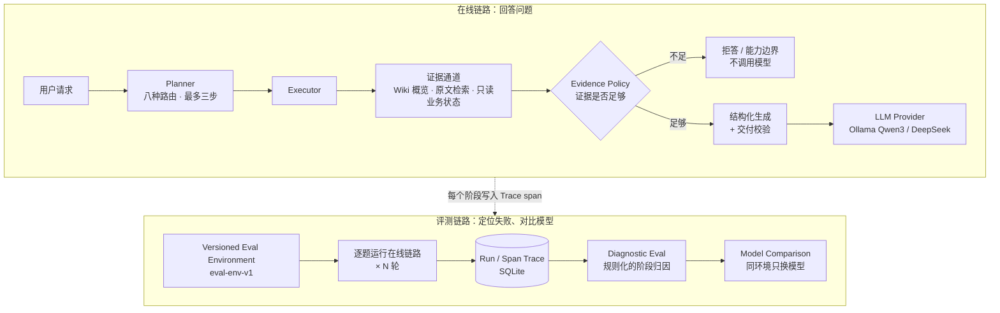

# 企业知识问答 Agent：可追踪、可诊断、可复现评测

面向企业制度/知识问答的 **Agent 工程项目**，不只是一个 RAG Demo。除了检索和生成，项目的重点是这套工程链路：请求先被**规划**，再按计划取证，证据不足就**拒答**；模型通过统一接口**可替换**；每一步都有 **Trace**；失败能被**定位到具体阶段**；评测在**版本化、可校验的环境**里运行，模型对照可以复现。

**主链路：** Planner / Executor / Evidence Policy → LLM Provider → Run/Span Trace → Diagnostic Eval → Versioned Eval Environment → Model Comparison

| 当前已验证 | 结果 |
|---|---|
| 自动化测试 | **1140 项全部通过** |
| Eval Env V1 回答评测（40 题 × 3 轮） | Qwen3-4B 本地：**40/40、40/40、40/40**（Stage 3 之后）；DeepSeek API：39/40 × 3（Stage 3 之前测得，之后没有重跑） |
| `h008` | Trace + Diagnostic Eval 定位为 **planning 阶段的 freshness 误判**；Stage 3 修复后，Qwen 从 0/3 变为 **3/3** |
| freshness 修复的泛化（隔离 holdout，24 条） | 误报 5 → **0**，precision 0.545 → **1.000**；但 recall 0.600 → **0.500**。这是一个取舍：误拒答减少了，漏报多了 1 条，而漏报不影响回答（见 [Stage 3](#stage-3从定位到修复)） |
| Qwen vs DeepSeek | 在这 40 题上**质量没有差异**（Stage 3 之前、同一份代码的对照）；DeepSeek 延迟更低（平均 1.96 s vs 3.60 s），但有 API 费用 |

> [!IMPORTANT]
> **`blind_v2` 已经在开发中被使用过**（M10 用它的路由结果做过验收基线），**不能再当作真正的盲测集**。上面的 validation 集同样是开发中见过的回归集。所以这些数字说明的是回归稳定性和链路可用性，**不是**对未见数据的泛化能力。Stage 3 的 temporal holdout 是唯一一份隔离编写的集合，但它已经开封过一次，以后也不能再当作 holdout 使用。

> **范围说明**：这是一个本地运行的演示项目，**不是生产系统**。语料是一份模拟的公司制度（约 20 个知识块）；「业务状态」通道读的是仓库内的样例数据，没有接入真实企业系统；没有登录鉴权和写操作。

---

## Architecture



上面是在线链路，每个请求在其中经过规划、取证、证据判断和生成，每个阶段都会写入 Trace。下面是评测链路：在固定环境里逐题运行在线链路，读取 Trace 找出每个失败出在哪个阶段，再在同一环境下只替换模型做对比。

## Why this project

多数 RAG Demo 只能回答"这次答对了吗"。真正做 Agent 时更难的问题是：

- **答错了，错在哪一步？** 是路由错了、没检索到、证据判断错了，还是模型生成错了？只看最终答案无法区分。
- **换了模型或改了代码，变好了还是变坏了？** 如果评测环境（语料、索引、配置、数据集）没有固定下来，前后结果不可比。
- **模型能不能换？** 业务代码直接调用某个模型的 HTTP 接口，换模型就要改业务代码。

这个项目针对这三个问题各做了一层基础设施，并用它们定位并修复了一个具体问题（h008，见下文）。

## Core capabilities

- **规划与取证**：Planner 判定请求需要哪几条证据通道（Wiki 概览、原文条款、只读业务状态），共八种路由、最多三步；Executor 执行；Evidence Policy 判定证据是否足够，不足时直接拒答，不调用模型。
- **混合检索**：Jieba + BM25 + Embedding + RRF，高置信问题走 BM25 快速路径，复合问题拆子问题并用 LLM 重排。
- **答案交付校验**：结构化输出，检查引用编号越界、缺引用、复述问题、无依据的数量；失败时最多复查一次，仍不通过就拒答。只做**形式上可判定**的检查，不判断语义是否正确。
- **LLM Provider**：统一的 `chat` / `chat_stream` 接口，支持本地 Ollama（Qwen3-4B）和 DeepSeek API（OpenAI 兼容）。通过 `.env` 切换，业务代码不感知。为适配 DeepSeek 的 JSON 模式所做的 prompt 调整会被记录下来，不会悄悄发生。
- **应用层**：FastAPI + Vue 3，SSE 流式回答，多会话，SQLite 持久化，文档增量更新，Wiki 后台编译与发布/回退。详见 [docs/APP_DETAILS.md](docs/APP_DETAILS.md)。

## Trace / Diagnostic Eval

**Trace**（[`agent_trace.py`](agent_trace.py)）

- 每个请求是一个 run，每个阶段是一个 span：router、planner、tool_call、evidence、generation、llm_call、commit。记录内容包括输入输出、耗时、token 数和失败归属，存在 SQLite 中。
- 敏感字段会被脱敏；响应头带 `X-Run-Id`，可以直接查到对应的 Trace。`TRACE_ENABLED=0` 可以整体关闭。
- 开销用 TRACE 开/关的 A/B 测量（[`eval/trace_overhead.py`](eval/trace_overhead.py)）：请求走真实路径（FastAPI → planner → executor → evidence → 生成 → provider → SQLite），只把检索和模型换成立即返回的 mock。开、关两组交替执行，每组 200 次。下表是在当前集成版本 `551bab2` 上的结果（[`eval/pmi_trace_overhead.json`](eval/pmi_trace_overhead.json)）：

| 接口 | OFF p50 / p95 | ON p50 / p95 | 平均差值（95% CI） | 占真实请求 p50 的比例 |
|---|---|---|---|---|
| `/api/chat` | 23.3 / 47.3 ms | 42.4 / 66.8 ms | +20.9 ms（+18.5 ~ +23.2） | Qwen 0.74% · DeepSeek 1.8% |
| `/api/chat/stream` | 28.3 / 46.4 ms | 50.3 / 75.5 ms | +23.9 ms（+21.9 ~ +25.8） | Qwen 0.85% · DeepSeek 2.1% |

- 表中的比例都以 post-main-integration 评测里真实请求的 p50 作分母：Qwen 2.81 s，DeepSeek 1.16 s。相对 mock 请求本身（20–30 ms）的开销约为 +78%，但这个比例不能代表实际开销。
- 历史测量：Stage 1（`8899d66`）时，`/api/chat` 的平均差值是 +19.4 ms，约占真实请求的 +0.7%（[`eval/stage1_trace_overhead.json`](eval/stage1_trace_overhead.json)）。

```powershell
.\.venv\Scripts\python.exe -m agent_trace list
.\.venv\Scripts\python.exe -m agent_trace show <run_id>
```

**Diagnostic Eval**（[`diagnostic_eval/`](diagnostic_eval)）

- 对每个 case 的每一轮运行，读取它的 Trace，依次检查 routing → planning → tool → retrieval → evidence → generation 六个阶段。结果分为主错误（primary error）、连带影响（secondary）和潜在问题（latent）。
- **纯规则，不用 LLM 当裁判**。规则证明不了是生成的问题时，不会默认归到 generation；证明不了的情况会明确标为 unattributed，并注明原因：缺 Trace、环境故障、规则无法判定，或缺人工标签。
- 人工标签以 overlay 文件的形式附加在冻结的数据集上，并锁定数据集的 sha256。

**h008：这套诊断实际定位到的问题**

问题是"目前的制度里，核心协作时间是几点到几点？"。它在两个模型、合入 main 前后的所有轮次里都失败，而且失败方式完全一样：

| 阶段 | 实际发生了什么 |
|---|---|
| routing | `document_only`，正确 |
| planning | 因为"目前"，设置了 `requires_freshness=True` ← **主错误** |
| retrieval | 检索到了正确的知识块（工作时间条款） |
| evidence | 语料无法证明时效性，以 `freshness_unsupported` 拒答（连带影响） |
| generation | 没有发生 LLM 调用 |

结论：这个失败**与模型无关**，更换模型不会修好它；问题出在 planner 对"目前"的时效性判断。Stage 3 修复了这个问题，过程见下一节。

### Stage 3：从定位到修复

**根因：**

- planner 只要看到时间词（目前、现在、最新……）就设置 `requires_freshness`，不管这个词修饰的是什么。
- 文档证据不带观测时间，所以一旦被标了 freshness，"目前的制度里……"这类本来能回答的制度问题就必然被拒答。
- 这不是个例：dev 集里的 `answer_document_008` 也以同样的方式失败。

**修复（A′）：**

- 时间词只有出现在实时状态子句里才算 freshness。实时状态子句指需要读系统的子句，或者"我的……还剩 / 余额"这类个人余额。
- 路由逻辑不变。
- `requires_freshness` 的语义定义为一个**显式时效证据约束**，定义见 [`eval/stage3/LABELING.md`](eval/stage3/LABELING.md)：
  - flag 为 True 时，Evidence Policy 会额外要求至少有一条证据能证明答案是当前时点的值。
  - 普通系统查询即使 flag 为 False，用的也是带 `observed_at` 的系统证据。

**评测的顺序：**

1. 先提交 29 条专项 dev 标签，然后跑 baseline。
2. 由一个看不到 planner 和 dev 集的独立 agent 编写 24 条 holdout，并封存。
3. 先提交只能运行一次的开封脚本，再实现 A′、跑 dev。
4. 最后一次性打开 holdout，并跑 validation 回归。

| | 修改前 | A′ |
|---|---|---|
| dev freshness（29 条，标签先于修改） | 0.483；可回答却被误拒 13/17 | 1.000；误拒 0/17（有拟合成分） |
| **holdout freshness（24 条，只开封一次）** | 0.625；FP 5 / FN 4 | **0.792；FP 0 / FN 5** |
| holdout precision / recall | 0.545 / 0.600 | **1.000 / 0.500** |
| eval-env-v1 回答评测，Qwen × 3 轮 | 39/40（h008 0/3） | **40/40**（h008 3/3），其余 39 个 case 行为不变 |
| 路由评测 validation_v1 / dev | 路由 1.0 / 1.0 | 路由 1.0 / 1.0（没有变化） |

**precision 和 recall 的取舍：**

- A′ 用更严格的条件换来了零误报。代价是：当时间词和实时请求被逗号切到不同子句里时，会漏判，比如"截止到现在，我的调休余额还有多少"。
- 这两种错误的代价不对称：
  - **误报**必然导致一个能回答的问题被拒答。
  - **漏报**只是少了一次显式约束。只要路由正确，系统证据本来就带 `observed_at`，回答不受影响。
- holdout 的 5 条漏报里，3 条路由正确，不影响回答；另外 2 条的问题出在路由本身，freshness 改对了也解决不了。
- 所以 Stage 3 没有继续调整规则。另一个原因是，holdout 已经开封，继续调整也没有干净的衡量手段。
- 完整记录见 [HANDOFF §15](HANDOFF.md)，逐条分析见 [`eval/stage3/HOLDOUT_REVIEW.md`](eval/stage3/HOLDOUT_REVIEW.md)。

两条冻结的路由标签与新语义冲突。它们通过 overlay（[`eval/label_revisions/`](eval/label_revisions)）修订，原数据集没有改动：freshness 信号在原标签下是 79/80，修订后是 80/80，两个数字都会报告，这两条也不算作 planner 的改进。

## Reproducible Eval Environment

[`eval_env/`](eval_env) 把一次评测需要的所有输入冻结成一个版本化环境 `eval-env-v1`（[`eval/environments/`](eval/environments)），包括：数据集、诊断标签、原文语料、Wiki 页面和业务样例数据。代码提交、检索配置和索引指纹不锁定在环境里，而是随每次运行记录下来，用于判断两次运行是否可比。

- 用 manifest 记录每个文件的 sha256。`verify` 共 18 项检查，包括：每个输入文件的哈希、标签与数据集和 Wiki 语料的绑定关系、Embedding 模型的 digest，以及工作区是否干净。
- 默认**拒绝**在有未提交修改的工作区上运行；`--allow-dirty` 的结果只能作为探索，不能当基线。
- **拒绝**任何名字里带 blind 的数据集。
- 结果文件**只追加、不覆写**。Embedding 缓存按环境隔离。

```powershell
.\.venv\Scripts\python.exe -m eval_env verify --env eval-env-v1
.\.venv\Scripts\python.exe -m eval_env run --env eval-env-v1 --label my_run --runs 3
.\.venv\Scripts\python.exe -m diagnostic_eval --eval eval\my_run.json --labels eval\diagnostic_labels\validation_v1.labels.json
```

## Model comparison

[`eval/model_comparison.py`](eval/model_comparison.py) 在同一个 eval environment、同一份代码、同一份检索配置和索引下，**只替换 LLM Provider**，Qwen 和 DeepSeek 各跑 3 轮。两边都经过 Diagnostic Eval，并逐个 case 比较结果是否发生变化。

最新一组（post-main-integration baseline，报告见 [`eval/post_main_integration/qwen_vs_deepseek.md`](eval/post_main_integration/qwen_vs_deepseek.md)）：

| | Qwen3-4B（本地 Ollama） | DeepSeek `deepseek-flash`（API） |
|---|---|---|
| 每轮通过 | 39/40 × 3 | 39/40 × 3 |
| 失败归因 | h008 · planning_error | h008 · planning_error |
| 任务延迟 平均 / p95 | 3.60 s / 10.47 s | 1.96 s / 5.89 s |
| LLM 调用 / 工具调用 | 132 / 108 | 132 / 108 |
| API 费用（120 次任务） | 0（本地硬件成本未计） | $0.0128（全部在高峰时段）；更早一轮非高峰为 $0.0074 |

逐个 case 对比：39 个稳定通过，1 个两边都失败（h008），没有被修好、新失败或不稳定的 case。

> 这组对照是在 Stage 3 之前（`b8c8197`）测的。Stage 3 之后只重跑了 Qwen（40/40 × 3），DeepSeek 没有重跑。h008 的失败发生在模型调用之前、与模型无关，但在 DeepSeek 上真正重跑之前，这里不声称 DeepSeek 也是 40/40。

**怎么解读这个结果：**

- 在这 40 题上，两个模型的**正确率没有差异**。但这 40 题是开发中见过的回归集，唯一的失败又发生在模型被调用之前，所以这个数据集**区分不了两个模型的能力**，不能得出"两者能力相当"的结论。
- DeepSeek 的延迟更低，但要付 API 费用，费用还取决于调用时段。Qwen 的延迟取决于本机硬件。
- 为适配 DeepSeek 的 JSON 模式做了 prompt 调整（`json_object` 加上 schema 说明），这一点已记录在报告里。

## Current metrics

| 指标 | 数值 | 测量范围 |
|---|---|---|
| 自动化测试 | 1140 通过 / 1140 | Stage 3（Stage 3 之前 1129 项，本阶段新增 11 项） |
| Eval env 校验 | 18/18 | `eval-env-v1` |
| 路由评测 | validation_v1 1.0；dev 1.0 | 纯逻辑，不调用模型 |
| freshness 信号（路由集） | 原标签 79/80、79/80；应用 overlay 后 80/80、80/80 | 2 条冻结标签的修订见 [`eval/label_revisions/`](eval/label_revisions) |
| 回答评测，Qwen3-4B | **40/40 × 3 轮**，7 项 gate 全部通过，误拒率 0% | eval-env-v1（validation_v1，40 题），Stage 3 `5f0ff42` |
| 回答评测，DeepSeek | 39/40 × 3 轮 | Stage 3 之前（`b8c8197`）测得，之后没有重跑 |
| 失败归因 | Qwen 在 Stage 3 之后 0 个失败；unattributed 0 | Diagnostic Eval |
| freshness holdout（24 条，已开封） | precision 1.000 / recall 0.500（修改前 0.545 / 0.600） | Stage 3，只开封一次 |
| Trace 开销 | `/api/chat` 每个请求 +20.9 ms，约占真实请求 p50 的 0.74%（Qwen）/ 1.8%（DeepSeek） | 每组 200 次 A/B，`551bab2`（Stage 3 之前测得，之后没有重测） |

历史结果都保留在 `eval/` 中，不会被覆写：Stage 0 基线、Stage 1 Trace 回归、Stage 2.5 对照、post-main-integration baseline，以及 Stage 3 的 freshness 评测（`eval/stage3/`）。M10 阶段的验收记录见 [docs/M10_CLOSEOUT_REPORT.md](docs/M10_CLOSEOUT_REPORT.md)，每个阶段的完整记录见 [HANDOFF.md](HANDOFF.md)。

## Quick start

```powershell
# 1. 本地模型
ollama pull qwen3:4b
ollama pull nomic-embed-text

# 2. 依赖
py -m venv .venv
.\.venv\Scripts\python.exe -m pip install -r requirements.txt -r requirements-dev.txt

# 3. 配置（默认 LLM_PROVIDER=ollama；若用 DeepSeek，在 .env 中填入 DEEPSEEK_API_KEY）
copy .env.example .env

# 4. 测试（模型调用使用测试替身；api.py 导入时会初始化 data\ 下的 SQLite，建议在隔离副本中运行）
.\.venv\Scripts\python.exe -m unittest discover

# 5. 启动 API 与前端
.\start_api.ps1
cd frontend; npm install; npm run dev
```

API 文档在 http://127.0.0.1:8000/docs，页面在 http://127.0.0.1:5173。演示时要先上传 `sample_company_rules.md`，并在页面上打开「三通道模式」。完整的演示步骤见 [docs/DEMO_GUIDE.md](docs/DEMO_GUIDE.md)。

## Repo structure

```text
knowledge-agent/
├── orchestration/         # Planner / Executor / Evidence Policy 与三个通道适配器（纯逻辑）
├── rag.py                 # 切分、混合检索、重排、生成与答案交付校验
├── llm_provider.py        # 统一 LLM 接口：Ollama / DeepSeek（OpenAI 兼容）
├── agent_trace.py         # Run/Span Trace：记录、脱敏、失败归属、CLI
├── diagnostic_eval/       # 规则化的阶段诊断与报告
├── eval_env/              # 版本化评测环境：make / verify / run / diff
├── eval/                  # 基线、诊断报告、模型对照（只追加）；environments/ 存放 eval-env-v1
├── chat_orchestration.py  # HTTP 层与编排链路之间的衔接
├── api.py                 # FastAPI / SSE
├── storage.py             # SQLite 持久化
├── wiki_runtime.py        # Wiki 编译任务、发布、回退
├── wiki_maintenance/      # Wiki 编译器与构建仓库
├── frontend/              # Vue 3 + Vite
├── tests/                 # 1140 项自动化测试
├── eval_*.json            # 评测数据集
├── evaluate*.py           # 评测脚本
├── HANDOFF.md             # 每个阶段的决策、结果与风险记录
└── docs/                  # 应用细节、演示指南、M10 报告
```

应用层的完整说明见 **[docs/APP_DETAILS.md](docs/APP_DETAILS.md)**，内容包括：完整目录树、API 列表、演示流程、持久化与 Wiki 生命周期、M10 验收记录和产品边界。

## Known limitations / Roadmap

**已知限制**

- **评测集**：`blind_v2` 已被开发使用，validation_v1 和 dev 也都是见过的数据。Stage 3 的 temporal holdout 已经开封，今后只能当作回归集。目前**没有干净的未见评测集**，所有数字都不能当作泛化能力。
- **规模**：只有一份约 20 个知识块的模拟语料，40 题 × 3 轮。样本量不足以支撑统计意义上的模型比较。
- **freshness recall**：holdout 上的 recall 是 0.500。当时间词和实时请求落在不同子句里，或者使用了"刚刚 / 本周"这类词表里没有的词时，会漏判。这些漏报在运行时不影响回答，Stage 3 有意没有继续调整。
- **路由缺口**：有几类请求没有被识别为系统请求，例如记录号和状态词被逗号拆进两个子句、"申请"类记录、个人年假余额。这些会影响回答，但不在 Stage 3 范围内。
- **Diagnostic Eval** 在当前集合上只见到一种失败，规则的覆盖面还没有在多样的失败上得到检验。
- **应用层**：单 worker、进程内锁；`client_id` 不等于鉴权；业务状态通道只开放库存查询，读的是样例数据；答案校验不判断语义。
- **工程细节**：代码哈希按工作区文件计算，CRLF 与 LF 的差异会造成误报，应改为对 git blob 规范化后计算；eval_env 对 DeepSeek 记录的模型信息不完整；DeepSeek 的费用按公开价目表估算，没有和账单核对。

**Roadmap**

1. 建立新的、真正不参与开发的盲测集，在它上面重跑 baseline 和模型对照。
2. 修复路由缺口（记录号和状态词分句、"申请"类记录、个人余额），先在 dev 上开发，再用新的隔离 holdout 衡量。
3. 代码哈希规范化；eval_env 按 provider 分别记录模型信息。
4. 语义层面的答案校验（引用与结论是否相符）。
5. 应用层：鉴权、多实例、真实只读数据源（需先有可信身份解析）。
