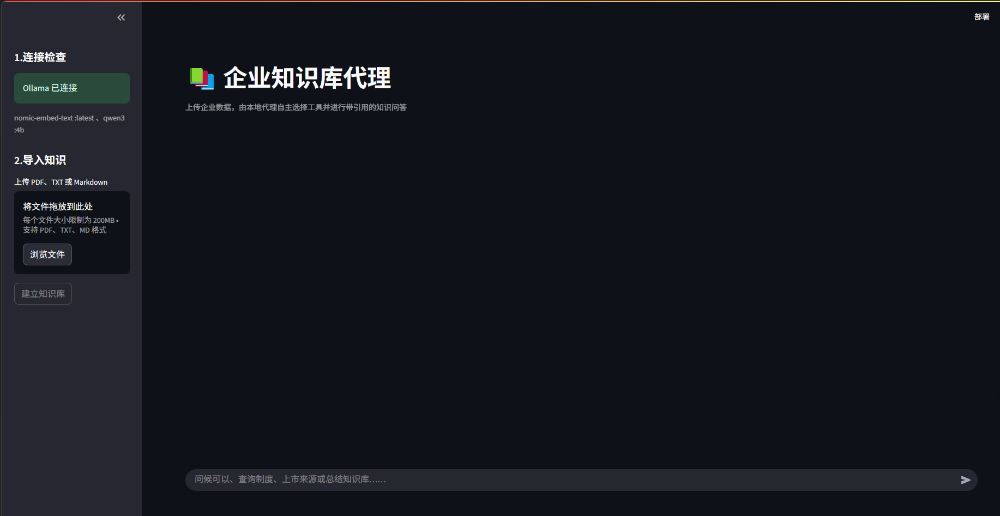
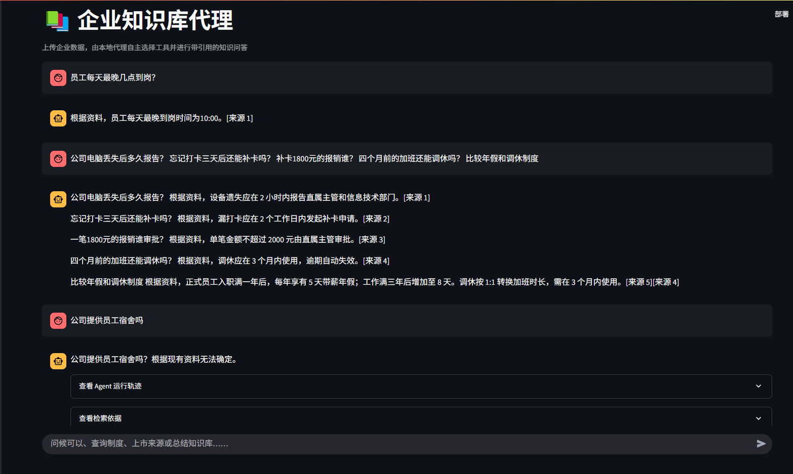
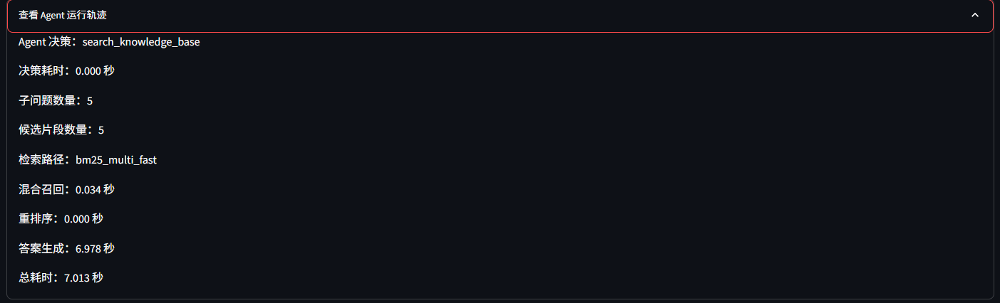
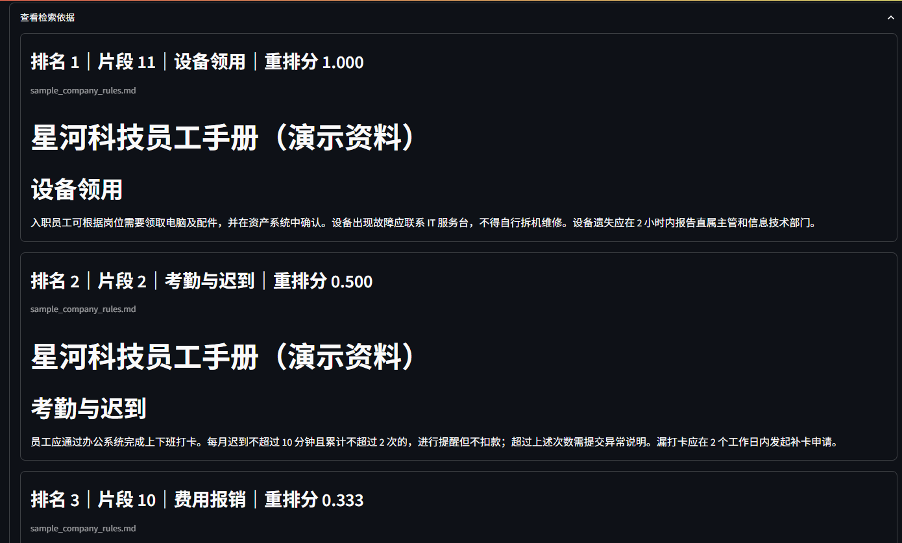
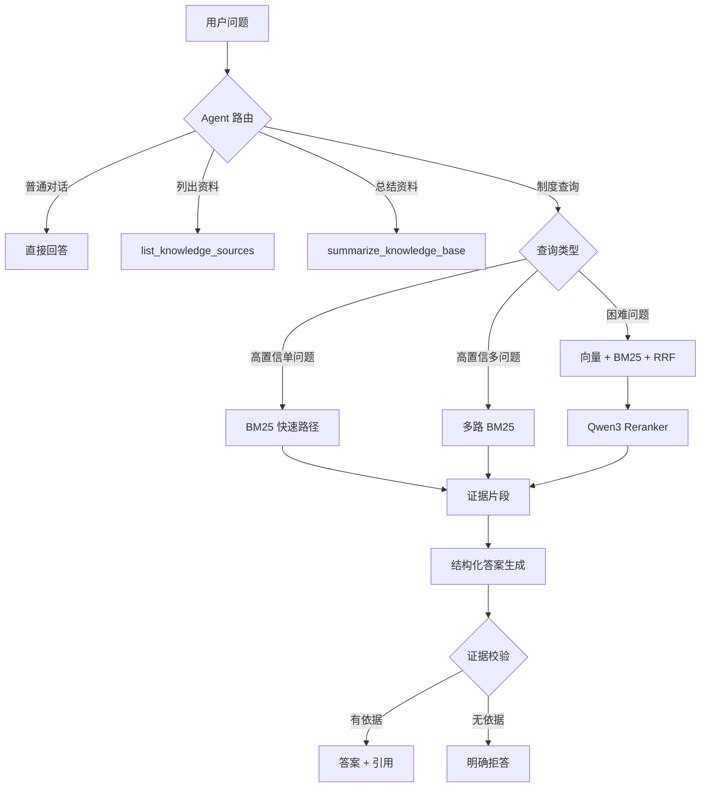

# 企业知识库 Agent

一个完全本地运行的中文企业知识库 Agent。系统能够读取 PDF、TXT 和 Markdown，使用 BM25 与向量检索召回资料，通过 Qwen3 重排序、回答并标注来源；Agent 可自主选择搜索、列出来源或总结知识库工具。

## 功能截图

### 本地模型连接与知识库导入



### 单问题、多问题拆分与无依据拒答



### Agent 运行轨迹与性能统计



### 检索来源与重排结果



## 项目亮点

- 本地运行：Ollama + Qwen3，不依赖付费 API
- Agent Tool Calling：搜索、来源列表、知识库总结
- 混合检索：Jieba + BM25 + Embedding + RRF
- Qwen3 Reranker：对困难候选进行最终排序
- 复合问题分解：支持一次询问多个制度
- 比较型查询：支持“比较年假和调休制度”
- 证据引用：展示文件、章节、片段和排名
- 防幻觉：无答案拒答、证据复查与失败降级
- 性能优化：批量 Embedding、向量缓存、总结缓存、高置信快速路径
- 可观测性：展示 Agent 决策、检索路径及各阶段耗时
- 自动评测：检索、Agent 路由和无答案测试集

## 系统架构



## 技术栈

- Python 3.12
- Streamlit
- Ollama
- Qwen3 4B
- nomic-embed-text
- Jieba
- pypdf

## 快速开始

### 1. 下载模型

```powershell
ollama pull qwen3:4b
ollama pull nomic-embed-text
```

### 2. 创建环境

```powershell
py -m venv .venv
.\.venv\Scripts\python.exe -m pip install -r requirements.txt
```

### 3. 启动

```powershell
.\start.ps1
```

或：

```powershell
.\.venv\Scripts\python.exe -m streamlit run app.py
```

浏览器访问 `http://localhost:8501`，上传 `sample_company_rules.md` 后建立知识库。

## Agent 工具

| 工具 | 用途 |
|---|---|
| `search_knowledge_base` | 查询企业制度、流程和事实 |
| `list_knowledge_sources` | 列出文件与章节 |
| `summarize_knowledge_base` | 总结整份知识库 |

## 检索策略

1. 明确且 BM25 领先时走快速路径；
2. 比较型问题拆成多个子查询；
3. 困难问题使用向量与 BM25 召回，通过 RRF 融合；
4. Qwen3 对候选做语义重排序；
5. 最终答案仅基于选中证据生成。

## 评测结果

数据集为自建中文员工制度资料：20 个章节、80 条有答案检索题、20 条无答案题、15 条 Agent 路由题。

| 基础召回器 | Recall@1 | Recall@3 | MRR |
|---|---:|---:|---:|
| 纯向量 | 38.8% | 58.8% | 0.529 |
| 纯 BM25 | 91.3% | 97.5% | 0.946 |
| RRF 融合 | 65.0% | 85.0% | 0.763 |

其他结果：

- Agent Tool Selection Accuracy：100%（15/15）
- 无答案拒答准确率：100%（20/20）
- 无答案平均耗时：7.97 秒
- 无答案最大耗时：9.77 秒
- 同一文档第二次建立索引：约 0.002 秒
- 典型单问题优化后：约 3.8 秒
- 四意图复合问题优化后：约 10.7 秒

> 以上结果来自自建模拟数据，仅用于项目回归与方案比较，不代表通用生产性能。

## 运行测试

```powershell
# 基础检索
.\.venv\Scripts\python.exe evaluate.py

# 扩展检索
.\.venv\Scripts\python.exe evaluate.py eval_cases_extended.json

# Agent 路由
.\.venv\Scripts\python.exe evaluate_routes.py

# 无答案拒答（较慢）
.\.venv\Scripts\python.exe evaluate_no_answer.py

# 全部测试
.\run_tests.ps1
```

## 项目结构

```text
knowledge-agent/
├── app.py                    # Streamlit 页面与交互
├── agent.py                  # Tool Calling、路由、来源与总结工具
├── rag.py                    # 切分、Embedding、BM25、RRF、重排与回答
├── evaluate.py               # 检索评测
├── evaluate_routes.py        # Agent 路由评测
├── evaluate_no_answer.py     # 无答案拒答评测
├── eval_*.json               # 测试数据
├── sample_company_rules.md   # 演示员工手册
├── start.ps1                 # Windows 启动脚本
└── requirements.txt
```

## 已知限制

- 当前 Embedding 模型在中文制度检索上弱于 BM25；
- Qwen3 4B 偶发错误拒答，已通过证据复查降低风险；
- 扫描版 PDF 尚未接入 OCR；
- 当前知识库保存在单机内存与本地缓存，不支持多租户；
- 测试数据是模拟资料，生产使用需重新构建领域测试集。

## 后续方向

- 中文 Embedding 与 Cross-Encoder 对照实验
- FastAPI 与 React 前后端分离
- SQLite 会话与用户隔离
- OCR、文档权限和审计日志
- Docker 化部署
