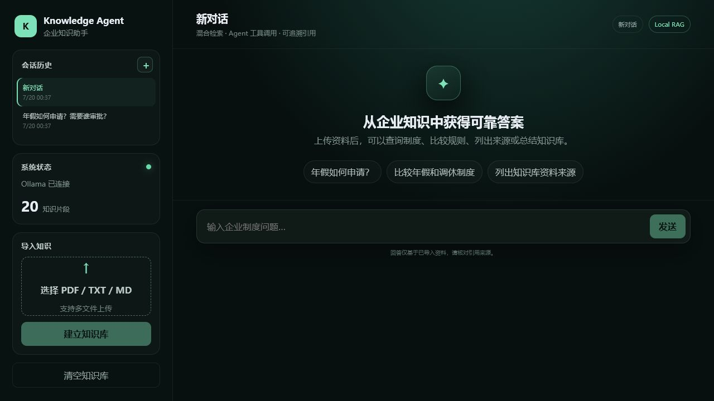
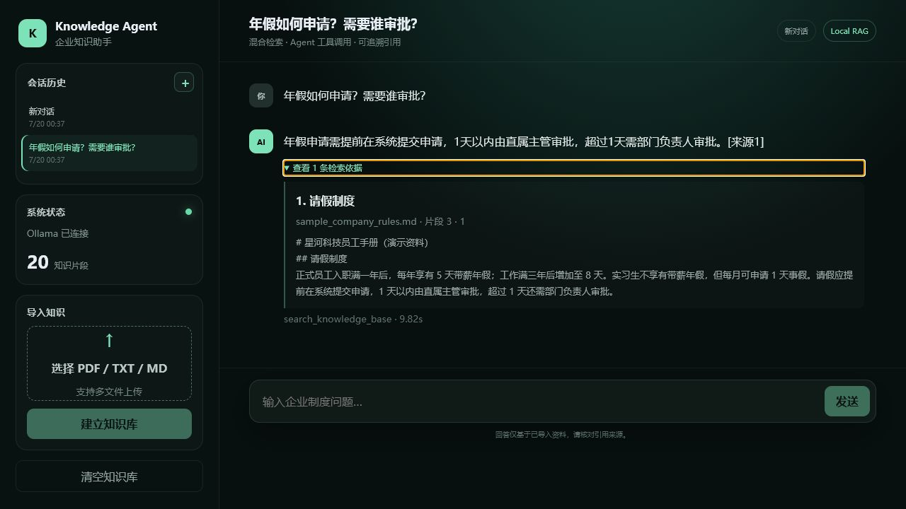
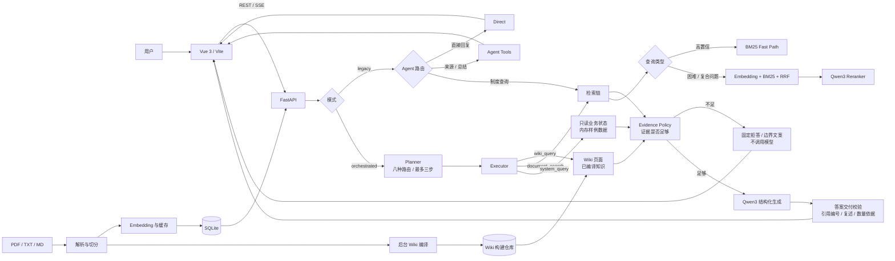

# 企业知识库 RAG Agent

一个基于本地大模型的企业知识问答系统。项目采用 Vue 3 + FastAPI 前后端分离架构，支持多格式文档导入、混合检索、Agent 工具路由、SSE 流式回答、引用溯源、多会话管理与 SQLite 持久化。

在此之上提供一条**只读三通道**问答链路：`wiki_query` 给出已编译的主题概览，
`document_search` 给出原文条款，`system_query` 给出当前业务状态。系统先判定一个请求
需要哪几条通道，合并证据后作答；证据不足时明确拒答，能力未开放时给出固定边界文案。

系统默认使用 Ollama 运行 Qwen3 4B 和 nomic-embed-text，不依赖付费模型 API。原有 Streamlit 页面仍保留，可作为轻量原型入口。

> **范围说明**：这是一个本地演示项目。三通道里的「业务状态」读的是仓库内的内存样例
> 数据，**只开放库存查询**，没有接入任何真实企业系统；也没有登录鉴权和写操作。

## 页面预览

### 会话管理与知识库状态



### 流式回答与检索依据



## 核心能力

- 文档处理：导入 PDF、TXT、Markdown，按标题和重叠窗口切分文本。
- 混合检索：Jieba + BM25 + Embedding + RRF；高置信问题走 BM25 快速路径。
- 语义重排：Qwen3 对候选片段重排，复合问题为每个子问题选择证据。
- 三通道编排：Planner 判定需要哪几条证据通道（Wiki 概览 / 原文条款 / 只读实时
  状态），Executor 执行，Evidence Policy 判定证据是否足够。八种路由，最多三步。
- Agent 路由：legacy 模式保留直接回复、知识检索、来源列表和知识库总结工具。
- 回答校验：结构化输出、引用编号校验、缺引用检测、复述问题检测、数量依据核对、
  无依据拒答，以及至多一次的证据复查。
- 流式交互：SSE 分阶段返回路由、检索、来源、文本增量和运行轨迹。
- Wiki 生命周期：上传后台编译成 Wiki 构建，发布、回退、清空和重启恢复；
  已被替代的旧文档会同时从检索索引和 Wiki 中退役。
- 增量更新：同名文档再次上传按文档 upsert，不再整体重建索引。
- 会话管理：新建、切换、恢复和删除会话，浏览器匿名客户端逻辑隔离。
- 持久化：SQLite 保存知识块、向量、会话、消息、引用和运行轨迹。
- 并发一致性：同一会话生成锁、知识库原子替换和知识版本校验。
- 自动化验证：991 项单元/接口测试，以及检索相关性、路由、回答与拒答评测集。

## 系统架构

前端与 FastAPI 之间有两种链路。默认 legacy 链路保持原有单一检索行为；勾选
「三通道模式」后走 Planner → Executor → Evidence Policy 的编排链路。



## 技术栈

| 模块 | 技术 |
|---|---|
| 前端 | Vue 3、Vite、Fetch、SSE、Marked、DOMPurify |
| API | FastAPI、Pydantic、Uvicorn |
| RAG | Jieba、BM25、Embedding、RRF、Qwen3 Reranker |
| 模型 | Ollama、Qwen3 4B、nomic-embed-text |
| 存储 | SQLite、Embedding 文件缓存 |
| 测试 | unittest、FastAPI TestClient |

## 快速开始

### 1. 准备模型

```powershell
ollama pull qwen3:4b
ollama pull nomic-embed-text
```

### 2. 安装后端依赖

```powershell
py -m venv .venv
.\.venv\Scripts\python.exe -m pip install -r requirements.txt
```

### 3. 启动 FastAPI

```powershell
.\start_api.ps1
```

API 文档：http://127.0.0.1:8000/docs

### 4. 启动 Vue 前端

另开一个 PowerShell：

```powershell
cd frontend
npm install
npm run dev
```

页面地址：http://127.0.0.1:5173

### 5. 上传样例文档（演示必做）

通过左侧「导入知识」上传仓库根目录的 **`sample_company_rules.md`**，等待侧栏
「知识片段」数量大于 0。

跳过这一步只能演示 Wiki 与库存查询，涉及原文的问题会返回「当前没有可用的文档知识库。」

全新安装尚无已发布构建时，Wiki 使用仓库自带的四主题样例页面；Document 通道
依赖上传建立的原文索引。上传完成后原文索引即可查询，同时会提交后台 Wiki 编译任务。
请等待 `/api/wiki/status` 显示 `published` 后再演示更新后的 Wiki；编译期间仍读取
先前发布的构建，两条路径在发布完成前可能处于不同版本。

### 6. 打开「三通道模式」

右上角勾选 **三通道模式** 即可启用 Wiki / 原文 / 只读实时状态三通道链路。
关闭时走原有 legacy 链路，路由、检索与 SSE 协议均不变。

两条链路共用生成层的答案交付校验。引用越界、缺少必要引用或无依据事实会触发
有界复查；最终不能交付时返回明确拒答。SSE 会先完成校验再发送正文，拒答也通过
`delta` 和 `done` 正常结束并保存到会话。传输、解析或请求处理错误使用 `error` 事件，
失败回答不落库。缓冲会增加首段可见正文的等待时间，相关耗时单独记录。

### 7. 六步演示流程

一条能把本项目主要能力串起来的最短路径。逐题脚本、预期路由与排查表见
**[docs/DEMO_GUIDE.md](docs/DEMO_GUIDE.md)**。

| 步骤 | 做什么 | 看什么 |
|---|---|---|
| 1 上传资料 | 导入 `sample_company_rules.md` | 知识片段数 > 0；后台开始编译 Wiki |
| 2 三通道问答 | 分别问概览、原文条款、SKU 库存 | 三题分别走 `wiki_only`、`document_only`、`system_only` |
| 3 复合请求 | 一句话同时要概览、准确条款和库存 | 走 `wiki_document_system`，证据卡片三类齐全 |
| 4 文档更新 | 改一条规则后同名重新上传 | 只有该文档的知识块被替换，Wiki 重新编译 |
| 5 新事实生效 | 再问同一条规则 | 答案与引用变成新值，旧值不再出现在证据里 |
| 6 拒答与边界 | 问资料里没有的事；问订单状态 | 前者明确拒答，后者返回能力边界文案，两者都不编答案 |

完整演示流程、固定问题与预期路由见 **[docs/DEMO_GUIDE.md](docs/DEMO_GUIDE.md)**。

详细使用说明见 [FRONTEND.md](FRONTEND.md)。如需运行原有 Streamlit 版本：

```powershell
.\start.ps1
```

## 上下文与持久化

- SQLite 按 `client_id + conversation_id` 保存全部聊天记录。
- 每次推理只加载当前会话最近 4 条消息，避免上下文无限增长。
- 文档默认按约 220 字切块，并保留约 40 字重叠。
- 检索通常召回 8 个候选，最终向模型提供最相关的 4 个片段；`top_k` 是上限而不是
  配额——明显低于最佳命中的尾部结果会被丢弃，因此实际条数常少于 4。
- 复合问题最多拆成 3 个检索子查询，超出时合并相邻分句而不丢弃；多分句问题同样
  不超过 `top_k` 条；有分句归属时优先覆盖尚未得到依据的问题，同覆盖增益再比较相关性。预算不足以容纳所有事实时仍遵守上限。
- FastAPI 重启时从 `data/knowledge_agent.db` 恢复知识块、向量和会话。
- 上传同名文档按文档 upsert，只替换该文档的知识块；不同名文档并存。
- 清空知识库会原子替换索引，并清除不再兼容的历史会话。

## Wiki 生命周期

Wiki 是从上传文档派生的**编译知识**，与原文是两种知识形态、同一来源。

1. 上传文档后，后台任务把该文档切成来源片段并编译成一个新的 Wiki 构建；
2. 构建通过校验后发布，成为该请求之后的「当前 Wiki」，无需重启 API；
3. 被新文档替代的旧文档，会同时从检索索引和 Wiki 中退役，避免旧事实继续被引用；
4. 编译失败时回退到上一个已发布构建，不会让 Wiki 处于半更新状态；
5. 清空知识库会一并清空 Wiki 构建；重启后从仓库恢复已发布的构建。

在第一个构建产生之前，仓库自带的 `wiki_pages/sample_company_wiki.json` 作为兜底，
所以全新安装也能直接演示。**它只覆盖 4 个主题**（请假与年假、远程办公、信息安全、
账号与权限），共 11 条 claim；语料其余章节要经过一次真实编译才会进入 Wiki。

## API

| 方法 | 地址 | 用途 |
|---|---|---|
| GET | `/api/health` | 模型连接与知识库状态 |
| POST | `/api/knowledge/upload` | 上传文档、按文档 upsert 索引并触发 Wiki 编译 |
| GET | `/api/wiki/status` | Wiki 编译任务状态与当前已发布构建 |
| DELETE | `/api/knowledge` | 清空知识库、Wiki 构建与历史会话 |
| POST | `/api/chat` | 非流式问答（`mode=orchestrated` 走三通道链路） |
| POST | `/api/chat/stream` | SSE 流式问答（同样支持 `mode=orchestrated`） |
| GET/POST | `/api/conversations` | 查询或新建会话 |
| GET | `/api/conversations/{id}/messages` | 恢复会话消息 |
| DELETE | `/api/conversations/{id}` | 删除会话 |

## 评测结果

所有数字都来自本地模拟资料（`sample_company_rules.md`，20 个知识块），仅用于项目
回归与方案比较，**不代表通用生产性能**。下面按「哪一轮测的、用什么题集、跑几轮」
分开列，不把不同轮次的结果混在一张表里。

### 早期检索方案比较（历史记录，未在本轮重测）

80 条有答案检索题、20 条无答案题、15 条 Agent 路由题，legacy 单一检索链路。

| 检索方法 | Recall@1 | Recall@3 | MRR |
|---|---:|---:|---:|
| 纯向量 | 38.8% | 58.8% | 0.529 |
| 纯 BM25 | 91.3% | 97.5% | 0.946 |
| RRF 融合 | 65.0% | 85.0% | 0.763 |

- Agent Tool Selection Accuracy：100%（15/15）
- 无答案拒答准确率：100%（20/20）

分组结果与复现命令见 [EVALUATION.md](EVALUATION.md)。

### M10 当前验收与收尾（2026-09-15）

本阶段工程约束与预设量化门槛通过，按已披露范围交付。Document 保留默认 `top_k=4`，
严格遵守调用方证据上限与最多三个召回子查询；合并保留原始分句，预算分配优先补充尚未
覆盖的问题。无效复查不会覆盖有效首轮答案，普通/SSE共用交付决策。

| 检查 | 当前结果 | 证据范围 |
|---|---|---|
| 单元/接口测试 | 991 项通过 | 最终48f候选，Python 3.12.14，隔离源码副本 |
| 公开路由 dev / validation / blind_v2 / holdout | 80/80、80/80、80/80、78/80 | 四套逐题零新增回归 |
| 实现方未见路由80题 | 77/80，边界38/40 | 本次冻结替换后的独立集 |
| 公开V2回答40题×3轮 | 39/40、39/40、39/40 | ASR95%、FRR5%；006稳定拒答计失败 |
| 独立回答40题×3轮 | 自动40/40；严格语义各39/40 | 020附加审批关系不完整 |
| 独立20题检索 | 静态18/20、原文19/20、动态六次均20/20 | 各路径Hit@3均20/20；合计中位数57/60 |
| 最终真实API/SSE | 自动各8/8；严格语义各7/8；边界/拒答各4/4 | 实际HTTP、全部delta、终态和SQLite正文 |
| 真实资料更新 | 两条路径均从5天切换为6天 | 上传、发布、新事实引用和落库全部验证 |
| 前端生产构建 | 成功，18个模块 | 未作浏览器端到端验收 |

最终 `rag.py` 原始字节哈希为 `48f9ecd9c55ab7459b2c06a6cd16d05e85f044d8fbd8cd06ad512ed2c5bc6f79`。
广泛回答和三路径检索实际测于 `8b8fd6b5…`；224次路径影响检查证明最后一处变更不会
进入这些题的执行分支，因此保留旧测量身份并继承不受影响的行为证据，没有改标成最终版重跑。
六次动态编译只有一种实际内容哈希，不能据此宣称已消除编译方差。新检索集替换了曝光题，
历史55/60与本次57/60也不能直接归因于代码改进。

最终同环境配对使用同模型、同暖机，并由外部观察器把两侧模型连接映射到IPv4 loopback。
普通总耗时p95为3.126→3.254秒（+4.09%），SSE为2.875→3.252秒（+13.09%），
均满足25%门槛；SSE首段正文p95为1.389→3.299秒（+137.54%），单独报告缓冲代价。
较早发生的180秒模型服务超时保留为失败批次，不拿它制造加速结论。

**仍有明确的质量限制**：公开复合12题×3轮的k=3检索覆盖93.47%，预算内上界94.58%；
有一次模型漏选，尽管预算仍有空位。默认k=4本组达到预算内上界98.33%。真实复合回答
仍有无依据预支否定、条件遗漏和错引；覆盖率不等于语义正确率，也不代表生产验收完成。
Wiki的claim自身分数只裁主排序分数相等的记录，主分数相等的跨页记录也可能改变次序，
不能称为“仅同页平局”。

完整结果、原始记录索引、源码身份、取舍、未覆盖项和归档清单见
**[M10收尾验收报告](docs/M10_CLOSEOUT_REPORT.md)**。旧实现与各轮返修报告保持原样，
其中的历史“不通过”、旧测试数量和旧候选哈希不代表本次状态。验收报告记录的是提交前冻结快照，后续提交状态以 Git 历史为准。

## 运行验证

后端验收请在隔离源码副本运行，并隔离其 `data` 与 Wiki 目录。`api.py` 导入会按源文件位置初始化 SQLite，仅切换工作目录不能保护真实数据库。下面是副本内已有测试环境的命令形态；也可使用原项目解释器的绝对路径。

```powershell
# 安装测试依赖
.\.venv\Scripts\python.exe -m pip install -r requirements-dev.txt

# 单元与接口测试（模型调用使用测试替身；在隔离源码副本中运行）
.\.venv\Scripts\python.exe -m unittest discover -v

# 通道判定评测（纯逻辑，无模型）
.\.venv\Scripts\python.exe evaluate_orchestrated_routes.py `
    --dataset eval_orchestrated_routes_blind_v2.json --output out\route-v2.json

# 检索相关性评测（静态 Wiki / 动态 Wiki / 原文三条路径）
.\.venv\Scripts\python.exe evaluate_retrieval_relevance.py --output-dir out\relevance

# 回答、拒答与边界评测（真实本地模型，3 轮）
.\.venv\Scripts\python.exe evaluate_answerability.py `
    --dataset eval_answerability_blind_v2.json --runs 3 --output-dir out\answer-v2

# 真实 API / SSE 两接口自测（会启动一个 uvicorn，占用一个空闲端口）
.\.venv\Scripts\python.exe verify_api_sse.py --output-dir out\api-sse

# 完整离线/本地模型评测
.\run_tests.ps1

# 前端生产构建
cd frontend
pnpm run build
```

`evaluate_retrieval_relevance.py` 与 `verify_api_sse.py` 是本轮新增的自测入口，
不被产品代码导入，也不改动任何既有评测程序或题集。两者都会在隔离目录里落原始结果，
`verify_api_sse.py` 启动时会打印它解析到的数据库路径——**请在隔离源码副本中运行**，
因为 `api.py` 在导入时就会按 `storage.py` 的位置解析数据库。

## 项目结构

```text
knowledge-agent/
├── api.py                       # FastAPI、SSE、会话与知识库接口
├── storage.py                   # SQLite 持久化与事务
├── agent.py                     # legacy Agent 路由和工具
├── rag.py                       # 切分、检索、重排、生成与答案交付校验
├── chat_orchestration.py        # HTTP 层与编排链路之间的胶水、能力边界文案
├── orchestration/               # 编排 sidecar（纯逻辑，不被 rag.py 反向依赖）
│   ├── planner.py               # 通道判定：八种路由，最多三步，纯函数
│   ├── executor.py              # 执行计划并汇总证据
│   ├── evidence_policy.py       # 证据充分性与权威裁决
│   ├── wiki_adapter.py          # Wiki 页面加载与检索
│   ├── document_adapter.py      # rag 检索 → Evidence 适配边界
│   └── system_provider.py       # 只读业务状态（库存）
├── wiki_runtime.py              # Wiki 编译任务队列与发布/回退/清空
├── wiki_maintenance/            # Wiki 编译器、构建仓库、来源片段与差异
├── wiki_pages/                  # 随仓库分发的样例 Wiki 页面
├── system_fixtures/             # 只读业务状态样例数据（SQLite 脚本）
├── app.py                       # 保留的 Streamlit 原型
├── frontend/                    # Vue 3 + Vite 前端
├── tests/                       # 自动化测试
├── eval_*.json                  # 检索相关性、路由、回答与拒答评测集
├── evaluate*.py                 # 评测脚本
├── verify_api_sse.py            # 真实 API / SSE 两接口自测
├── sample_company_rules.md      # 演示知识库
├── evaluation_runs/             # 历史评测原始记录（只追加，不覆写）
└── data/                        # 本地 SQLite 与 Wiki 构建（Git 忽略）
```

## 当前边界

- 适合本地演示和单 Uvicorn Worker；进程内锁尚未扩展到多实例部署。
- `client_id` 只用于演示级逻辑隔离，不等同于登录认证和服务端鉴权。
- **System 通道用的是内存中的样例数据**，来自 `system_fixtures/`，每次请求新建一个
  内存 SQLite。**没有接入任何真实企业系统**，也不会写入任何持久业务数据。
- System 通道**只开放库存查询**（`get_inventory_level`）。订单与审批属于主体范围
  查询，在可信身份解析器就位前主动不开放——不是查不到，而是避免用客户端自报的身份
  读取业务数据。问到这类内容会返回固定的能力边界文案，不调用模型。
- 一次只查一个 SKU。给了多个会返回拆分提示，这是产品限制，不是缺参数。
- 生产链路暂未接入结构化事实断言，因此**主链路不进行事实冲突裁决**。Evidence
  Policy 的权威裁决模块已实现并有测试覆盖，但当前没有生产数据触发它——有代码有测试
  不等于这条能力已经在主链路上生效。
- 答案交付校验只覆盖五类**形式上可判定**的问题：空答案、复述问题、引用编号越界、
  有证据却一处不标来源、答案里出现证据和问题都没有的「数字＋量词」。
  它**不判断结论与引用在语义上是否相符**，那仍需人工或独立验收逐条核对。
- 流式接口的校验分两处：来源标注在发出前验编号（可阻止），复述与数量核对在整段
  结束后进行（只能让本次回答以错误收尾，正文已经发出）。普通接口在同样判定失败时
  改为拒答。两条接口判定规则相同，但流式收不回已发出的文字。
- 前端没有测试框架，只有生产构建作为门禁。
- 当前检索会扫描内存中的全部知识块，大规模数据应迁移到专用向量数据库。
- 扫描版 PDF 尚未接入 OCR，上传文件也需要进一步增加大小和安全限制。

## 后续方向

- 接入真实企业只读数据源，并在此之前补上可信身份解析器
- 主链路接入结构化事实断言，让冲突裁决真正生效
- 引用与结论的语义相符校验（当前只校验编号有效性和数量依据）
- 一次查询多个 SKU，或提供批量库存操作
- 文档级权限、Qdrant / pgvector 与元数据过滤
- 历史摘要 + 最近消息的长对话记忆
- 登录鉴权、多实例部署与分布式锁
- Docker Compose、CI、结构化日志和请求追踪
- OCR、上传任务队列和索引进度
- 前端测试框架
