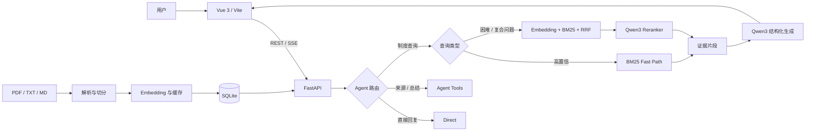

# 企业知识库 RAG Agent

一个基于本地大模型的企业知识问答系统。项目采用 Vue 3 + FastAPI 前后端分离架构，支持多格式文档导入、混合检索、Agent 工具路由、SSE 流式回答、引用溯源、多会话管理与 SQLite 持久化。

系统默认使用 Ollama 运行 Qwen3 4B 和 nomic-embed-text，不依赖付费模型 API。原有 Streamlit 页面仍保留，可作为轻量原型入口。

## 页面预览

### 会话管理与知识库状态


### 流式回答与检索依据


## 核心能力

- 文档处理：导入 PDF、TXT、Markdown，按标题和重叠窗口切分文本。
- 混合检索：Jieba + BM25 + Embedding + RRF；高置信问题走 BM25 快速路径。
- 语义重排：Qwen3 对候选片段重排，复合问题为每个子问题选择证据。
- Agent 路由：支持直接回复、知识检索、来源列表和知识库总结工具。
- 可信回答：结构化输出、引用标记、无依据拒答和证据复查失败保护。
- 流式交互：SSE 分阶段返回路由、检索、来源、文本增量和运行轨迹。
- 会话管理：新建、切换、恢复和删除会话，浏览器匿名客户端逻辑隔离。
- 持久化：SQLite 保存知识块、向量、会话、消息、引用和运行轨迹。
- 并发一致性：同一会话生成锁、知识库原子替换和知识版本校验。
- 自动化验证：25 项单元/接口测试，以及检索、路由和拒答评测集。

## 系统架构



## 技术栈

| 模块 | 技术 |
|---|---|
| 前端 | Vue 3、Vite、Fetch、SSE、Marked、DOMPurify |
| API | FastAPI、Pydantic、Uvicorn |
| RAG | Jieba、BM25、Embedding、RRF、Qwen3 Reranker |
| 模型 | Ollama、Qwen3 4B、nomic-embed-text |
| 存储 | SQLite、Embedding 文件缓存 |
| 测试 | unittest、FastAPI TestClient |

## 快速开始

### 1. 准备模型

```powershell
ollama pull qwen3:4b
ollama pull nomic-embed-text
```

### 2. 安装后端依赖

```powershell
py -m venv .venv
.\.venv\Scripts\python.exe -m pip install -r requirements.txt
```

### 3. 启动 FastAPI

```powershell
.\start_api.ps1
```

API 文档：http://127.0.0.1:8000/docs

### 4. 启动 Vue 前端

另开一个 PowerShell：

```powershell
cd frontend
npm install
npm run dev
```

页面地址：http://127.0.0.1:5173

### 5. 上传样例文档（演示必做）

通过左侧「导入知识」上传仓库根目录的 **`sample_company_rules.md`**，等待侧栏
「知识片段」数量大于 0。

跳过这一步只能演示 Wiki 与库存查询，涉及原文的问题会返回「当前没有可用的文档知识库。」

原因：Wiki 页面已经从这份样例规则派生并随仓库加载，无需上传；而 Document 通道
依赖上传后建立的检索索引。上传文件**只用于建立 Document 检索索引**，Wiki 页面则
是仓库内已编译好的样例页面——两者是不同的知识形态，但来源一致，所以摘要与原文条款
不会互相矛盾。

### 6. 打开「三通道模式」

右上角勾选 **三通道模式** 即可启用 Wiki / 原文 / 只读实时状态三通道链路。
关闭时走原有链路，行为不变。

完整演示流程、固定问题与预期路由见 **[docs/DEMO_GUIDE.md](docs/DEMO_GUIDE.md)**。

详细使用说明见 [FRONTEND.md](FRONTEND.md)。如需运行原有 Streamlit 版本：

```powershell
.\start.ps1
```

## 上下文与持久化

- SQLite 按 `client_id + conversation_id` 保存全部聊天记录。
- 每次推理只加载当前会话最近 4 条消息，避免上下文无限增长。
- 文档默认按约 220 字切块，并保留约 40 字重叠。
- 检索通常召回 8 个候选，最终向模型提供最相关的 4 个片段。
- FastAPI 重启时从 `data/knowledge_agent.db` 恢复知识块、向量和会话。
- 上传新知识库时原子替换旧索引，并清除不再兼容的历史会话。

## API

| 方法 | 地址 | 用途 |
|---|---|---|
| GET | `/api/health` | 模型连接与知识库状态 |
| POST | `/api/knowledge/upload` | 上传并构建知识库 |
| DELETE | `/api/knowledge` | 清空知识库与历史会话 |
| POST | `/api/chat` | 非流式问答 |
| POST | `/api/chat/stream` | SSE 流式问答 |
| GET/POST | `/api/conversations` | 查询或新建会话 |
| GET | `/api/conversations/{id}/messages` | 恢复会话消息 |
| DELETE | `/api/conversations/{id}` | 删除会话 |

## 评测结果

自建模拟员工制度数据包含 20 个知识块、80 条有答案检索题、20 条无答案题和 15 条 Agent 路由题。

| 检索方法 | Recall@1 | Recall@3 | MRR |
|---|---:|---:|---:|
| 纯向量 | 38.8% | 58.8% | 0.529 |
| 纯 BM25 | 91.3% | 97.5% | 0.946 |
| RRF 融合 | 65.0% | 85.0% | 0.763 |

- Agent Tool Selection Accuracy：100%（15/15）
- 无答案拒答准确率：100%（20/20）
- 无答案平均耗时：11.48 秒；最大耗时：24.07 秒
- 自动化测试：25/25 通过

评测环境、分组结果、回归问题和复现命令见 [EVALUATION.md](EVALUATION.md)。这些结果来自本地模拟资料，仅用于项目回归与方案比较，不代表通用生产性能。

## 运行验证

```powershell
# 安装测试依赖
.\.venv\Scripts\python.exe -m pip install -r requirements-dev.txt

# 单元与接口测试
.\.venv\Scripts\python.exe -m unittest discover -v

# 完整离线/本地模型评测
.\run_tests.ps1

# 前端生产构建
cd frontend
pnpm run build
```

## 项目结构

```text
knowledge-agent/
├── api.py                    # FastAPI、SSE、会话与知识库接口
├── storage.py                # SQLite 持久化与事务
├── agent.py                  # Agent 路由和工具
├── rag.py                    # 切分、检索、重排与生成
├── app.py                    # 保留的 Streamlit 原型
├── frontend/                 # Vue 3 + Vite 前端
├── tests/                    # 自动化测试
├── eval_*.json               # 检索、路由与拒答评测集
├── evaluate*.py              # 评测脚本
├── sample_company_rules.md   # 演示知识库
└── data/                     # 本地 SQLite 数据（Git 忽略）
```

## 当前边界

- 适合本地演示和单 Uvicorn Worker；进程内锁尚未扩展到多实例部署。
- `client_id` 只用于演示级逻辑隔离，不等同于登录认证和服务端鉴权。
- 三通道模式下**只开放库存查询**（`get_inventory_level`）。订单与审批属于主体范围
  查询，在可信身份解析器就位前主动不开放——不是查不到，而是避免用客户端自报的身份
  读取业务数据。
- Planner 的确定性规则会让「制度 / 规定」等政策语义压制弱实时意图，因此
  「库存管理制度怎么规定，SKU-A100 还有多少？」只会走原文通道。改用强精确标记
  （如「请附原文依据」）可稳定走 `document_system`。详见
  [docs/DEMO_GUIDE.md](docs/DEMO_GUIDE.md) 的「已知限制」。
- 生产链路暂未接入结构化事实断言，因此**不进行冲突裁决**。Evidence Policy 的权威
  裁决已实现并有测试覆盖，但当前没有生产数据触发它。
- 前端没有测试框架，只有生产构建作为门禁。
- 上传会整体替换知识库，尚未实现单文档增量新增、更新和删除。
- 当前检索会扫描内存中的全部知识块，大规模数据应迁移到专用向量数据库。
- 扫描版 PDF 尚未接入 OCR，上传文件也需要进一步增加大小和安全限制。

## 后续方向

- 文档 Hash 去重、增量索引和文档级权限
- Qdrant / pgvector 与元数据过滤
- 历史摘要 + 最近消息的长对话记忆
- Docker Compose、CI、结构化日志和请求追踪
- OCR、上传任务队列和索引进度
